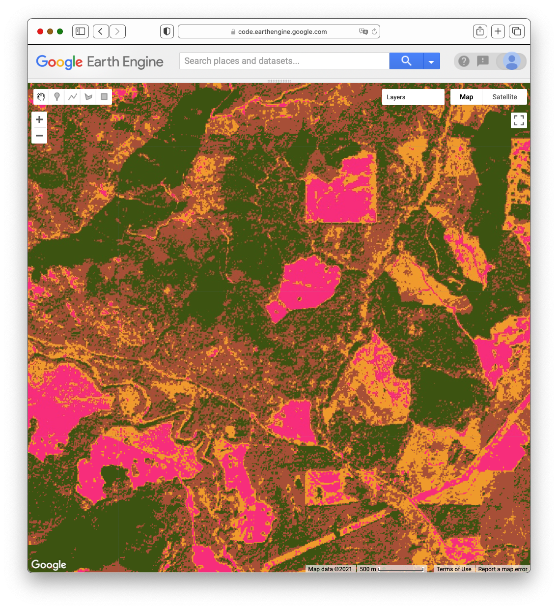
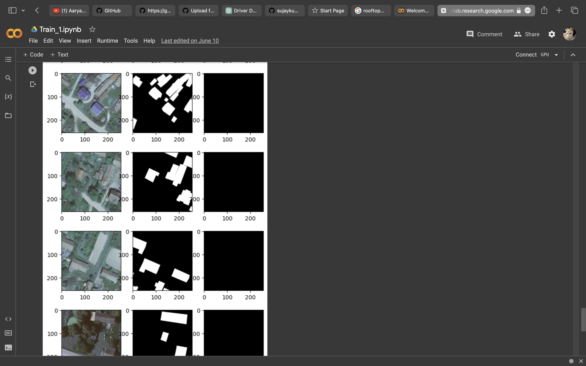

# Rooftop Segmentation using Google Earth (GE)

This project focuses on rooftop segmentation using Google Earth (GE) imagery. Leveraging geo-spatial data, Tensorflow, and Google Cloud Platform (GCP), the project aims to facilitate advanced drone delivery methodologies and conduct comprehensive data analysis research.

## Table of Contents

- [Introduction](#introduction)
- [Features](#features)
- [Installation](#installationprocedure)
- - [Configuring Server and Client](#configuringserver)
- [Usage](#usage)

## Introduction

**In an era of increasing urbanization, optimizing the utilization of spaces becomes crucial. This project, "Rooftop Segmentation using Google Earth (GE)," tackles this challenge by harnessing the power of geo-spatial data, TensorFlow, and the Google Cloud Platform (GCP) to pave the way for advanced drone delivery methodologies and comprehensive data analysis research. With the rise of urban populations and limited available space, the efficient use of rooftops becomes pivotal. By leveraging the capabilities of Google Earth imagery, we aim to identify and segment rooftops accurately. The goal is to provide insights for potential utilization, such as drone delivery drop-off points or urban gardening spaces. To achieve this, we employ deep learning techniques and sophisticated data analysis.

**

## Features

- Utilizes Google Cloud Platform (GCP) for scalable processing.
- Applies geo-spatial data and Tensorflow for advanced segmentation.
- Dataset sourced from LandStat resources.
- Employes the UNet architecture for robust rooftop segmentation.

## Installation Procedure

    git clone https://github.com/sujaykumarmag/object_detection_ge.git
    cd object_detection_ge
    
### Configuring Server
    
    cd flask-server
    python3 -m venv venv
    source venv/bin/activate
    pip3 install --upgrade -r requirements.txt
    
    
### Starting Server
    
    python3 server.py
    
### Configuring Client

    cd client
    npm install

### Starting Client

    npm start
    
- `requirements.txt is added`

### To install the packages

    pip install -r requirements.txt
    
## Usage

1. **Set up your Google Cloud Platform credentials for access to GCP services.**

2. **Run the rooftop segmentation script.**

## Results

